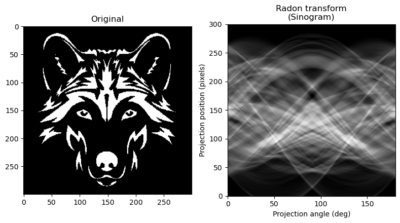
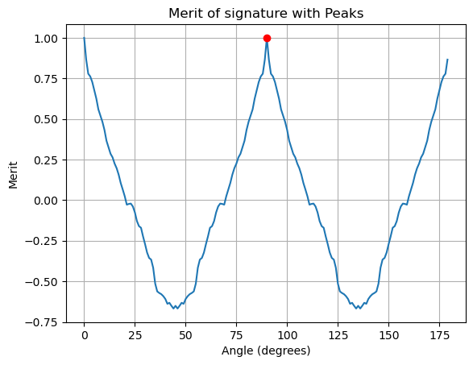

Python implementation of reflection symmetry detection of shapes based on shape signatures
===

This project involves the development of a Python implementation for detecting reflection symmetry in shapes using shape signatures based on [1]. Reflection symmetry detection is crucial in various applications, including computer vision, image processing, and pattern recognition. Shape signatures provide a compact representation of the shape's geometric features, facilitating efficient symmetry analysis.

## Reflection Symmetry Detection
The process of detecting reflection symmetry involves:

- Generating the shape signature: Extracting the shape signature from the binary image.
- Computing symmetry axes: Identifying potential axes of symmetry by analyzing the shape signature.
- Evaluating symmetry: Quantifying the degree of symmetry for each axis and determining the most symmetric one.

## Dataset Description

The dataset used in this project consists of binary images of various shapes, including both symmetric and asymmetric shapes. These images are chosen to evaluate the robustness and accuracy of the symmetry detection algorithm.

## Results comparison

- Using original image:




---

- Using skeleton:





## Install the environment in a local device
The following steps must be followed to install the dependencies required for running the application:

1. Navigate to the project directory
```
cd (`project_path`)
```

2. Create a conda environment from a .yml file
```
conda env create -f environment.yml
```

3. Install dependencies
```
pip install -r requirements.txt
```

## Project Structure
The project is organized as follows:

```
├── images
├── src
│   ├── centroid.py
│   ├── file.py
│   ├── symmetry.py
```

## Dependencies
The main libraries used in this project include:

- OpenCV
- NumPy
- Matplotlib
- Scipy
- scikit-image

## Evaluation
The evaluation process includes:

- Qualitative analysis: Visual comparison of detected symmetry axes on various shapes.
- Quantitative analysis: Using metrics such as symmetry accuracy (jaccard_similarity) to assess performance.

## References

[1] Nguyen, T. P., Truong, H. P., Nguyen, T. T., & Kim, Y. (2022). Reflection symmetry detection of shapes based on shape signatures. Pattern Recognition, 128, 108667. DOI: 10.1016/j.patcog.2022.108667
